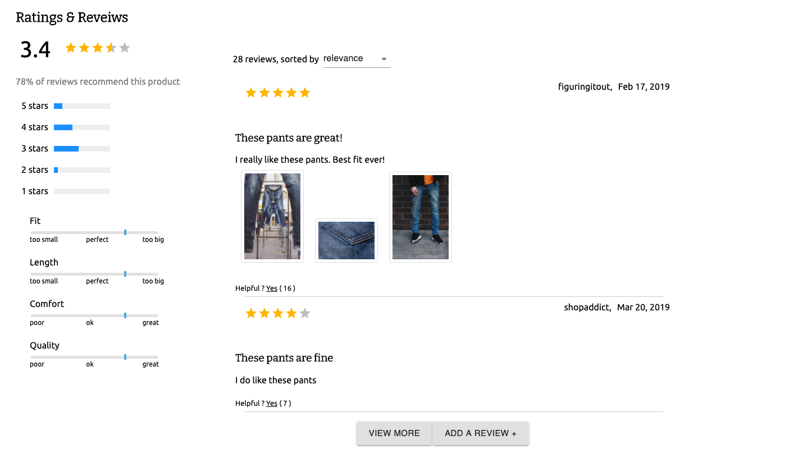

# S-Mart Ecommerce

The goal of this project was to create an ecommerce portal that adheres to unique business requirments. This project makes use React, Redux, Express and Material UI. 

 
---

## Table of Contents
1. [Setup](#Setup)
2. [Product Detail](#Product-Detail)
3. [Ratings and Reviews](#Ratings-and-Reviews)
4. [Contributers](#Contributers)

---

## Setup

>*Install dependencies*
```
npm install
```
>*Start the server*
```
npm start
```
Open `http://localhost:3000`

---
## Product Detail 

The product detail section displays relevant information for a single product in the catalogue. Some of the functionality include an image gallery, product information, style selector, and an add to cart feature. 


--- 

## Ratings and Reviews

The Ratings & Reviews section allows for the viewing and submission of reviews for the product selected. Some of the functionality contained in this feature include the ability to write new reviews, displayed reviews list, review sorting, rating breakdown, and product breakdown. 



---

## Contributers
AJ Benjumea<br>
Preston Rollins<br>
Jose Collado<br>

---

## License
[MIT](https://choosealicense.com/licenses/mit/)